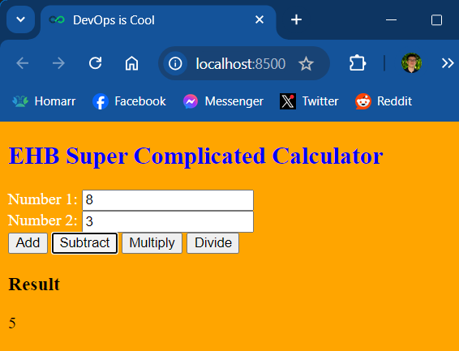
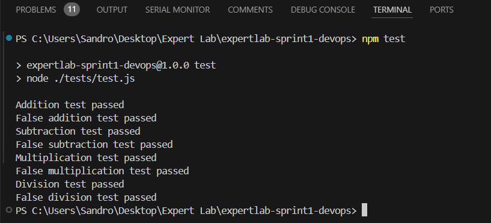
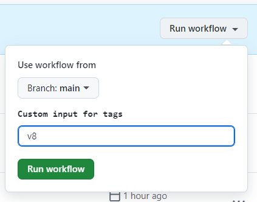
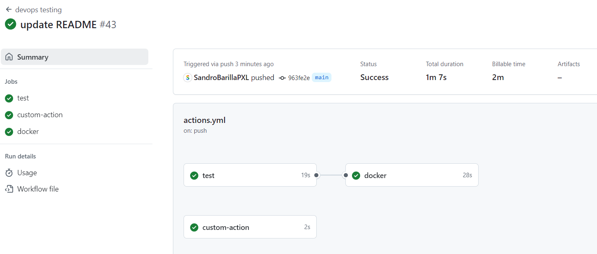
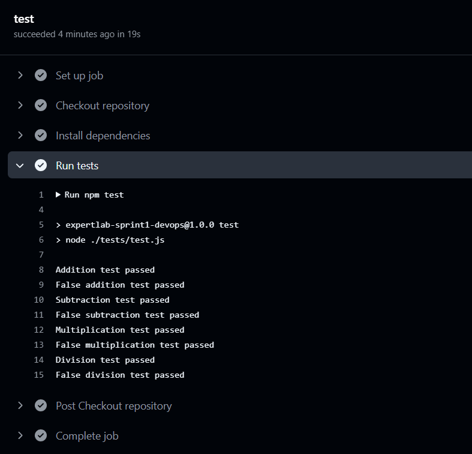
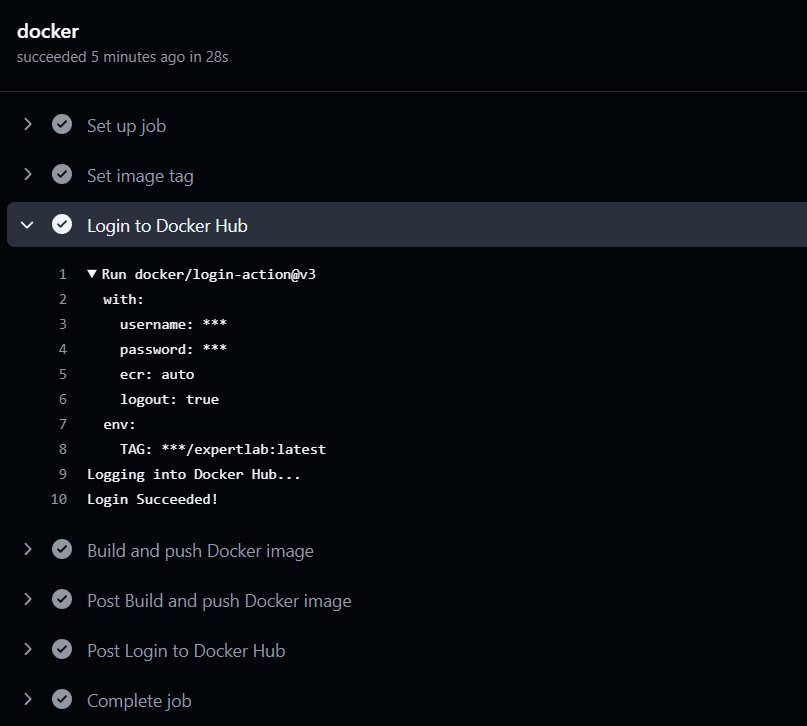
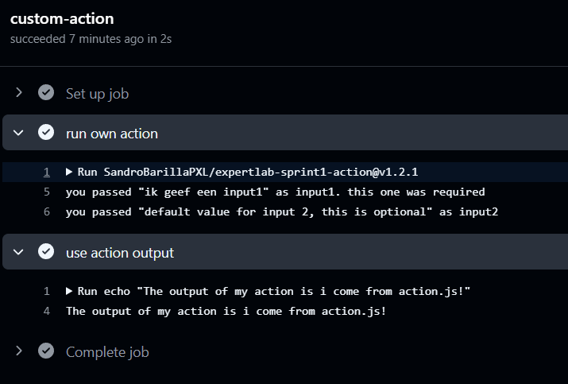
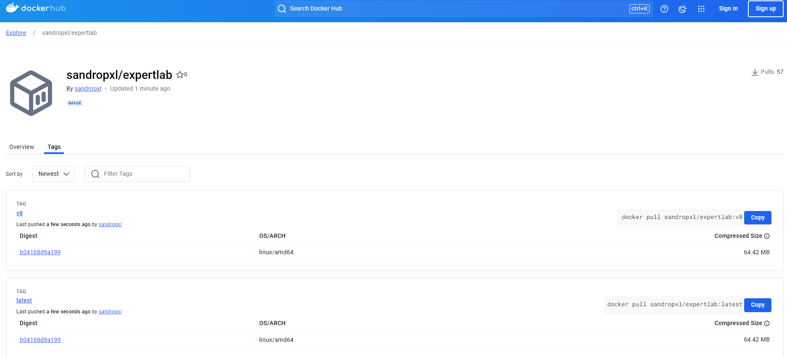
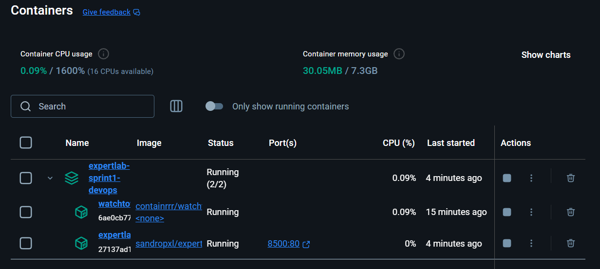
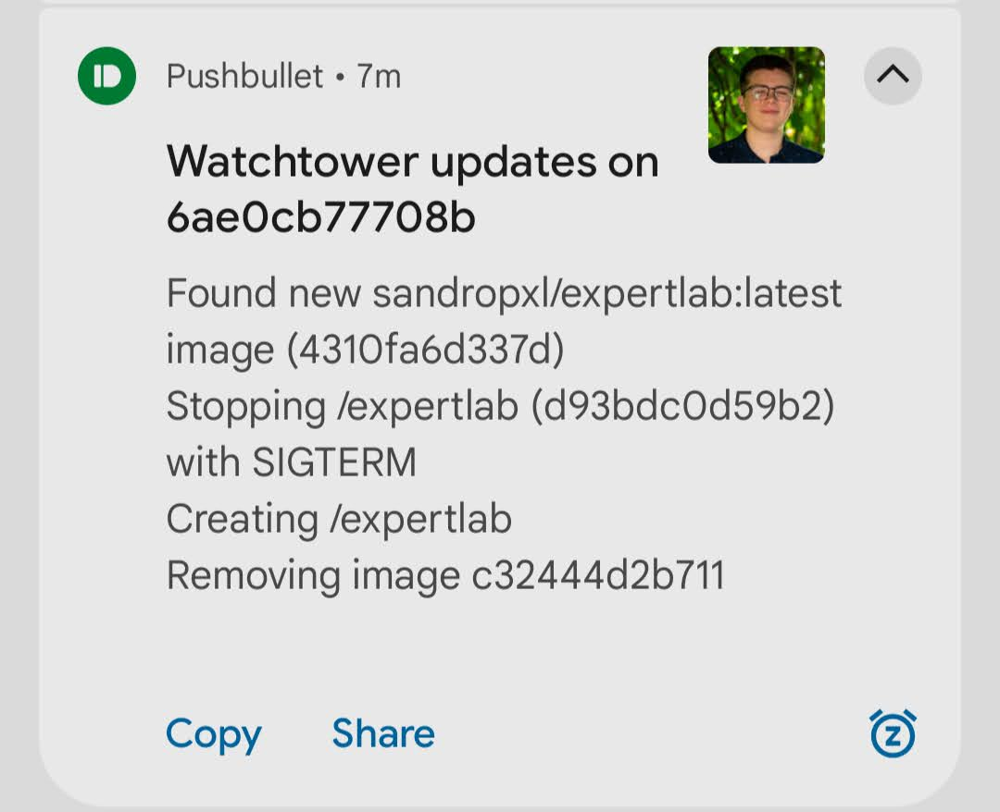

# expertlab-sprint1-devops
This repository serves as a PoC of GitHub Actions & DevOps

## App: EHB Super Complicated Calculator
This is a simple calculator app with some *unit.js* tests. Install the dependencies with `npm install` and then run the tests with `npm test`.
The frontend is a simple HTML file that uses the `script.js`and `functions.js` files to perform the operations. Run the frontend with a simple HTTP server of your choice, like the "live server" extension in Visual Studio Code for local use.

  
Screenshot

   
  

## Docker
The app is also dockerized. You can build the image from the included `Dockerfile` with `docker build -t <your-tagname> .`.
The Dockerfile uses an `nginx:alpine` base image. I chose this image because it is lightweight and has a small footprint. The website is copied to the `/usr/share/nginx/html` folder in the image, which is the default folder for the nginx server. The `npm` package is installed to to install the dependencies. The app is then available at the root of the server and exposed on port 80. To run the app, run `docker run -p [PORT]:80 <your-tagname>`. The app will be available at `http://localhost:[PORT]`

## GitHub Actions
This repository has a GitHub Actions workflow that runs the tests on every push to the `main` branch. After the tests have run, another job is triggered to set the appropriate tag, log in to Docker Hub, build the Docker image and push it to Docker Hub. You can check the workflow in the `.github/workflows` folder. Additionally, the workflow has a `workflow_dispatch` trigger that allows you to manually run the workflow from the [GitHub Actions UI](https://github.com/SandroBarillaPXL/expertlab-sprint1-devops/actions/workflows/actions.yml) with custom inputs to use as a tag for the Docker image. Finally, a custom action is used to demonstrate how to create a reusable action that can be used in multiple workflows (see [the other repo](https://github.com/SandroBarillaPXL/expertlab-sprint1-action)).

  
Screenshots

   
   
   
   
   
  

## Watchtower / Docker Compose
Watchtower is a tool that automatically updates the running Docker containers when a new image is pushed to the registry. A `docker-compose.yml` file is included in the repository that starts the app and the Watchtower containers. You can start both apps with `docker-compose up -d` and then push a new image to the registry to see Watchtower in action. 
  
Watchtower keeps track of all the running containers and periodically checks if a newer image is available. This can be configured how you like. For rapid testing purposes, I set a cron for each 15 seconds. When a new image is pushed, Watchtower will automatically pull it and restart the app container with its original arguments, also notifying you in the process. I used a notification service called "Pushbullet" to receive notifications on my phone, but you can use any other service that Watchtower supports. My access token is stored in a textfile called `pushbullet_access_token.txt` in the root folder that is mounted as a secret in the `docker-compose.yml` file. Evidently, this file is not present in the online repository.

  
Screenshots

   
  

## Sources
* https://www.npmjs.com/package/unit.js
* https://unitjs.com/guide/quickstart.html
* https://docs.docker.com/reference/dockerfile/
* https://docs.github.com/en/actions/writing-workflows/choosing-when-your-workflow-runs/triggering-a-workflow
* https://docs.github.com/en/actions/writing-workflows/choosing-when-your-workflow-runs/events-that-trigger-workflows#workflow_dispatch
* https://github.com/docker/build-push-action/tree/v3/
* https://containrrr.dev/watchtower/
* https://containrrr.dev/watchtower/arguments/#scheduling/
* https://containrrr.dev/watchtower/notifications/
* https://containrrr.dev/shoutrrr/v0.8/services/pushbullet/
* https://docs.docker.com/compose/how-tos/use-secrets/